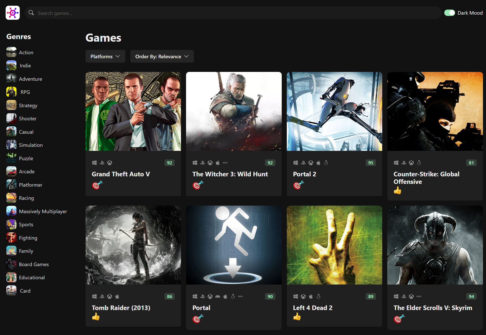

# GameHub

GameHub is a video game discovery web app that helps you find new and interesting games to play. With GameHub, you can search for games by platform, genre, and more.



## Features

- Discover new games by searching for specific platforms or genres.
- Get detailed information about each game, including ratings and platform.
- Browse a vast library of games to find something new and exciting to play.

## Getting Started

### Prerequisites

Make sure you have the following installed on your system:

- Node.js
- Yarn (or npm)

### Installation

To get started with GameHub, follow these steps:

### 1. Clone this repository to your local machine

```sh
git clone https://github.com/Rafiul-Islam/Game-Hub.git
```

### 2. Navigate to the project directory

```sh
cd Game-Hub
```

### 3. Install the required dependencies

```sh
yarn install
```

### 4. Get a RAWG API key

Go to [RAWG API Docs](https://rawg.io/apidocs) and create an account to get an API key.

### 5. Add the API key to the `.env` file

Create a `.env` file in the root of your project and add your RAWG API key:

```sh
VITE_APP_API_KEY=YOUR_RAWG_API_KEY
```

### 6. Run the development server

```sh
yarn dev
```

### 7. Open your browser

Navigate to `http://localhost:5173` to see the app in action.

---

Thank you for using GameHub! I hope you discover many new and exciting games to play.
